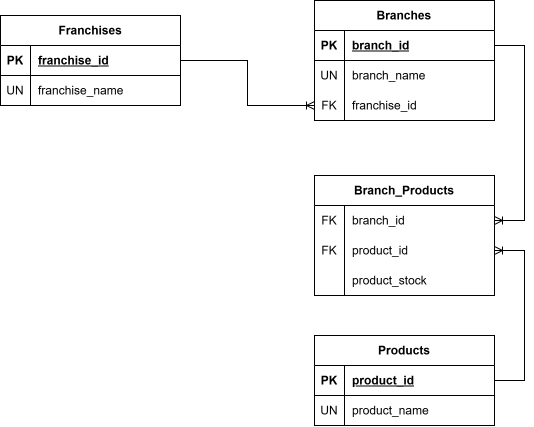

# Franchise Management API

A robust, reactive RESTful API designed to manage a hierarchical structure of franchises, branches, and product inventories. This project was developed as a Backend Developer Practical Test, focusing on clean architecture, reactive programming, and modern deployment practices.

## Core Features

- **Hierarchical Management**: Easily manage Franchises, their respective Branches, and the Products offered at each branch.
- **Inventory Control**: Add, remove, and update the stock of products in real-time.
- **Data Analytics**: Specialized endpoint to retrieve the product with the highest stock level for each branch within a specific franchise.
- **Reactive Architecture (Bonus)**: Built using **Spring WebFlux** and Project Reactor for non-blocking, highly concurrent execution.
- **Extended CRUD (Bonus)**: Dedicated endpoints to dynamically update the names of franchises, branches, and products.
- **Fully Dockerized (Bonus)**: The application and its database are containerized for seamless local deployment.
- **Cloud & IaC Ready (Bonus)**: Configured for cloud deployment with Infrastructure as Code (IaC) considerations.

## Tech Stack

- **Language**: Java 21
- **Framework**: Spring Boot (WebFlux)
- **Database**: MySQL
- **Persistence**: Spring Data R2DBC
- **Containerization**: Docker & Docker Compose
- **Infrastructure as Code**: Terraform
- **Version Control**: Git & GitHub (Feature Branch Workflow)

## Data Model

The following Entity-Relationship (ER) diagram illustrates the database architecture, highlighting the relationships between Franchises, Branches, and Products:



The database architecture follows a strict hierarchical model designed for high performance and straightforward data retrieval. As shown in the `FranchiseSystem.svg` diagram, the following design decisions were implemented:

* **Hierarchical Franchise Hierarchy:** The `branches` entity links to `franchises` via `franchise_id` (FK), enforcing a clear 1:N relationship where each branch belongs exclusively to one parent franchise.
* **Decoupled Product Catalog:** The `products` table maintains unique global product definitions (`product_id`, `name`), keeping the core catalog separate from operational branch data.
* **Normalized Inventory Junction (`branch_products`):** The M:N relationship between `branches` and `products` is resolved through the `branch_products` associative table. Placing `stock` directly inside this intersection table guarantees that inventory levels are strictly scoped to a specific branch-product pair without polluting the global product entity.
* **Database-Level Integrity Constraints:** Unique (`UN`) constraints on entity names prevent duplicate records for franchises, branches, and products.

## API Endpoints Reference

### Franchises
| Method | Endpoint | Description |
| :--- | :--- | :--- |
| `POST` | `/franchises` | Add a new franchise |
| `PATCH` | `/franchises/{id}/name` | Update the name of a franchise *(Bonus)* |

### Branches
| Method | Endpoint | Description |
| :--- | :--- | :--- |
| `POST` | `/franchises/{franchiseId}/branches` | Add a new branch to a franchise |
| `PATCH` | `/branches/{id}/name` | Update the name of a branch *(Bonus)* |

### Products & Inventory
| Method | Endpoint                                          | Description |
| :--- |:--------------------------------------------------| :--- |
| `POST` | `/branches/{branchId}/products`                   | Add a new product to a branch |
| `DELETE` | `/branches/{branchId}/products/{productId}`       | Remove a product from a branch |
| `PATCH` | `/branches/{branchId}/products/{productId}/stock` | Modify the stock quantity of a product |
| `PATCH` | `/products/{id}/name`                             | Update the name of a product *(Bonus)* |

### Analytics
| Method | Endpoint | Description |
| :--- | :--- | :--- |
| `GET` | `/franchises/{franchiseId}/max-stock` | Get the product with the most stock per branch for a specific franchise |

## Installation & Local Deployment

### Run the API and MySQL with Docker

Install Docker with Docker Compose and start the Docker daemon. No local Java, Maven, or MySQL installation is required. Run these commands from the repository root, with ports 8080 and 3306 available:

```bash
docker compose up --build -d
docker compose ps
docker compose logs -f api
```

The API is available at `http://localhost:8080/franchise_system/api`. All endpoints in the tables above are relative to this base URL. Wait for the application startup message in the logs before sending requests.

The multi-stage `Dockerfile` compiles with Java 21 and the Maven Wrapper, then runs the JAR with a Java 21 JRE as a non-root user. Tests are skipped during image construction because they use MySQL; run them separately as described below. `.dockerignore` restricts the build context to the application sources and build inputs.

Compose waits for MySQL's healthcheck to verify the schema before starting the API. Inside Docker, the API connects to `mysql:3306` through `SPRING_R2DBC_URL`, not `localhost`. MySQL is exposed only on `127.0.0.1:3306` for local development.

This configuration is for local development: it preserves the existing root login and default password. Override `MYSQL_ROOT_PASSWORD` in your shell before starting a fresh database; Compose supplies the same password to both services. Changing this variable does not change credentials in an existing volume. For production, use a dedicated database user and managed secrets.

MySQL data persists in the existing `mysql-data` volume. SQL scripts in `db/` run only when the database is first initialized. The existing `mysql:latest` image selection is retained to avoid an implicit downgrade of an existing volume; pin a compatible version before production deployment.

Stop the containers without deleting data:

```bash
docker compose down
```

Do not add `-v` unless you intend to permanently delete the database and reinitialize its schema.

### Run locally or execute tests

For execution outside Docker, install **JDK 21**. Stop the containerized API if it is running to free port 8080, then start only MySQL:

```bash
docker compose stop api
docker compose up -d --wait mysql
./mvnw spring-boot:run
```

Run the context-load test separately with MySQL running:

```bash
./mvnw test
```

On Windows, use `.\mvnw.cmd` instead of `./mvnw`. If you changed the database password, also set `SPRING_R2DBC_PASSWORD` for local runs and tests. The application otherwise uses the local database settings in `src/main/resources/application.yml`.

## Infrastructure (`infra/localstack/`)

The `infra/localstack/` directory provides an alternative hybrid deployment using LocalStack and AWS Secrets Manager:

- **`main.tf`**: Terraform config that provisions an `aws_secretsmanager_secret` holding database credentials (uses LocalStack endpoints at `http://localhost:4566`).
- **`compose.yml`**: A separate Docker Compose file (`infra/localstack/compose.yml`) that uses `mysql:8.4` with `HYBRID_DB_USER`/`HYBRID_DB_PASSWORD` credentials pulled from Secrets Manager — distinct from the root `docker-compose.yml`.
- **`deploy.py`**: Python script that calls `terraform apply`, reads the secret from LocalStack, and runs `docker compose -f compose.yml up --build -d --wait` against the hybrid stack, then smoke-tests the API.

For local development, use the root `docker-compose.yml`. The `infra/localstack/` stack is for cloud/IaC deployment scenarios.


#### Architecture & Best Practices
- **Routing is functional, not annotated**: endpoints live in `api/routes/*.java` (`RouterFunction`) and handlers in `api/handlers/*.java` — never create new `@RestController`s.
- **`config/` contains validators** (`ValidatorConfig`, `ReactiveValidatorConfig`) — not routers.
- **`branch_products` junction table has no Java entity** — it is accessed only via raw SQL `DatabaseClient` queries in `infrastructure/services` and `infrastructure/helpers`.
- **Reactive Streams:** Utilizes Mono and Flux to handle requests asynchronously, providing better resource utilization and scalability.

- **Separation of Concerns:** Strictly layered architecture separating Handlers, Services (Business Logic), and Repositories (Data Access).

Developed as a practical assessment for a Backend Developer position.

#### Study References
- [Reactive MySQL with Spring Boot](https://robinedwardellis.medium.com/reactive-mysql-with-spring-boot-1b184b9ea58a)